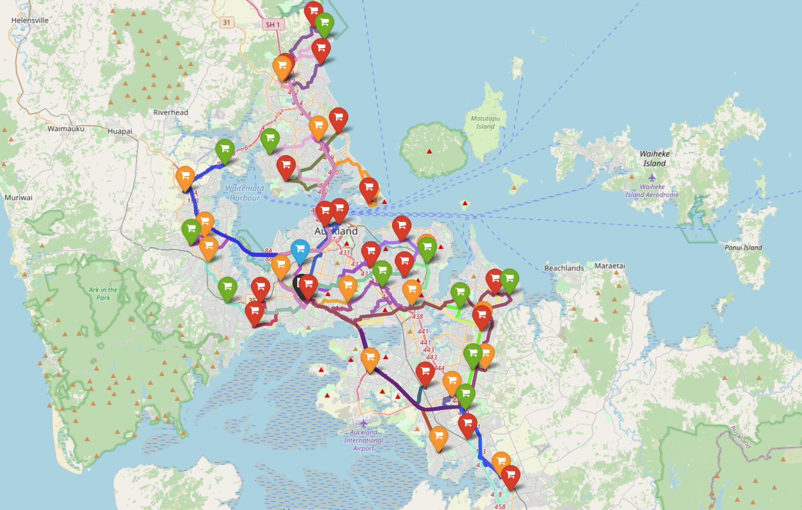

# Python Vehicle Routing
Contains an implementation of a vehicle routing problem (VRP) solver utilizing a genetic algorithm based TSP solver. This is augmented to a VRP solver using set partitioning and linear programming. Real world data is obtained using OpenStreetMaps and used to define the distance matrix for the VRP.
